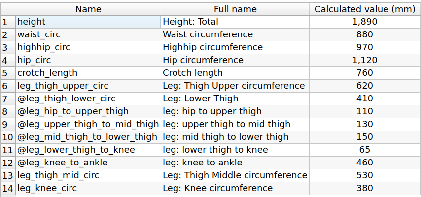
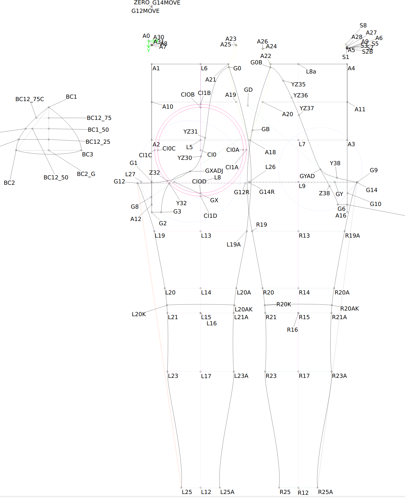

# Part 2: Download and alter the pattern

We'll be using [Seamly2D](https://seamly.net/) for altering the
pattern. I've tried to make everything in the pattern based on a
formula so it can be altered to your size, but you do need to
carefully look at it and do some adjustments of some lines. I'll
explain those steps here.

First download the pattern and sample measurements from the files in
the [src
directory](https://github.com/kigyui/latexpatterns/blob/master/inflatablehips/src/)

The "val" file is the main pattern, and the "vit" file contains my measurements (you'll alter these next).

## Your measurements

Open Seamly2D open the "vat" file and edit the measurements. Take the
measurements the pattern needs and enter ones to match you.  Latex is
forgiving a little, but you must use your exact measurements, don't
pull the tapemeasure tight or have it loose. The pattern is designed
to reduce the measurements to ensure a nice tight fit.  I've seen
friends get bad fitting made to measure latex because they assumed
they needed to adjust the measurements to make things tight
themselves.

## Eyeball the pattern

Go to the 'draw' section in Seamly2D.

At this stage the pattern should adjust itself to your
measurements. Take a look and compare it to mine to see if it looks
vaugely correct. Some of the curves may have not worked right, and
we'll deal with those next.

Some of the pieces we join together have curves, and those curves are
different on the two pieces, but the lengths of the curves have to be
the same. Latex doesn't look good if you end up having one piece more
stretched than another. Because we can't have this work automatically
we have the concept of "pattern zeros". What we do is take away the
difference between the length of the two curves of the pieces being
joined and show a line with ten times the length. If your pattern is
correct then all those pattern zeros will be either in the same
position, or no more than 10mm (which is 1mm in reality) different
from each other. If they are not, don't worry, we'll adjust them now.

Picture TBD

## Adjusting the curves

TBD

## Print the pattern and cut it out

Okay, that's our pattern done and ready to print.

Go to the 'Details' section in Seamly2D. You can export this now as a
SVG file. I imported it to Inkscape, drew a grid over it for
alignment, then poster printed it onto separate sheets, cutting and
sticking them together.

## Label the pattern

It's also worth now labeling the pattern; the butt pad parts need to
be the right way up as all the sides are not the same length, and you
don't want to end up cutting latex down a line which is actually a
fold line (like on the front, collar and back pieces). Notch the
alignment marks, it'll help transfer them to the pattern. I use this
device which creates nice alignment notches:
https://www.amazon.co.uk/Professional-Garment-Pattern-Stainless-Designer/dp/B07FKQNMWM/

This step always takes much longer than you expect.

Now on to part 3: transfer pattern and cut the latex: https://github.com/kigyui/latexpatterns/blob/master/inflatablehips/03-transfer.md
