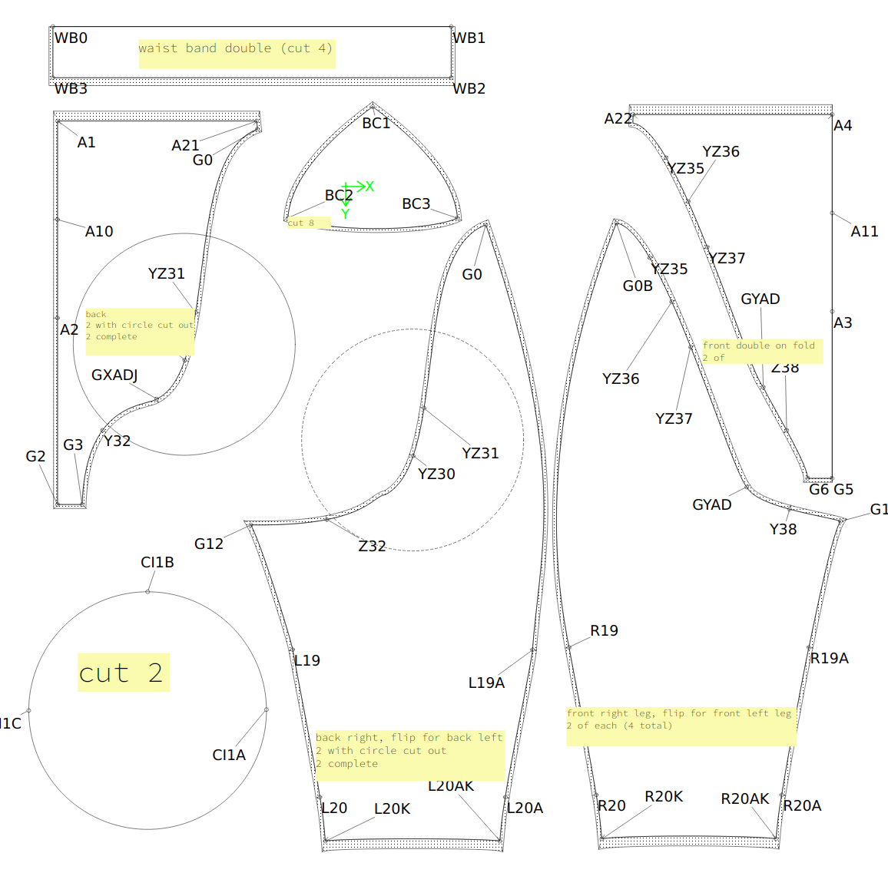

# Part 2: Download and alter the pattern

In theory we could make a few standard measurement patterns in PDF for download, like a "small" "medium" "large" kind of thing,
but really these are better made to measure.

We'll be using [Seamly2D](https://github.com/FashionFreedom/Seamly2D) for altering the
pattern. I've tried to make everything in the pattern based on a
formula so it can be altered to your size, but you do need to
carefully look at it and do some adjustments of some lines. I'll
explain those steps here.

First download the pattern and sample measurements from the files in
the [src
directory](https://github.com/kigyui/latexpatterns/blob/master/inflatablehips/src/)

The "val" file is the main pattern, and the "vit" file contains my measurements (you'll alter these next).

## Your measurements

Open Seamly2D open the main pattern and go to the menu to edit the "My measurements". Take the
measurements the pattern needs and enter ones to match you.  Latex is
forgiving a little, but you must use your exact measurements, don't
pull the tapemeasure tight or have it loose. The pattern is designed
to reduce the measurements to ensure a nice tight fit.  I've seen
friends get bad fitting made to measure latex because they assumed
they needed to adjust the measurements to make things tight
themselves.

Since we're making shorts that will inflate to give hips we want the
measurements to include the final hip size, near enough, so if you
have existing foam or silicone hips use these as they'll affect your
hip and upper thigh measurements. Each measurement in Seamly has a little
description and some have diagrams to help figure out where the measurement
is taken. Our pattern includes all the leg down to the ankle at the moment
even though we cut off just above the knee.

## Eyeball the pattern

Go to the 'draw' section in Seamly2D.

At this stage the pattern should adjust itself to your
measurements. Take a look and compare it to mine to see if it looks
vaugely correct. Some of the curves may have not worked right, and
we'll deal with those next.

Make sure the butt pad circle (in red) fit just within the pattern
piece. If not you can adjust the radius in the Variables table. You
could also adjust the "thickness" of the butt pad in the Variables
table. I just made a guess default and it seemed ok.

Adjust the curve from G0 down the leg, and G0B down the leg so that it roughly
aligns with the points A19 and G12R. Since this is inflatable it's not important
to be accurate, see my example above where we're close but not exact.

Some of the pieces we join together have curves, and those curves are
different on the two pieces, but the lengths of the curves have to be
the same. Latex doesn't look good if you end up having one piece more
stretched than another. Because we can't have this work automatically
we have the concept of "pattern zeros". What we do is take away the
difference between the length of the two curves of the pieces being
joined and show a line with ten times the length. If your pattern is
correct then all those pattern zeros will be either in the same
position, or no more than 10mm (which is 1mm in reality) different
from each other. If they are not, don't worry, we'll adjust them now.

## Adjusting the curves

So if the line G12Move exists we need to adjust the angle of G12 until
it's nearly zero length. Click on G12 and adjust the angle in 0.1 degree
increments and watch until G12Move line reduces. Then do the same with
G14 angle until G14Move goes mostly away.

Next look at Z32 and Y32. They should both be about the same distance from
the red circle as each other (on mine they touch it, but they don't need to
touch it). Adjust the curve GXADJ-G3 and GXADJ-G12 so they're similar.  We
have to join those two curves later and they need to be the same length.

This is what happened when I didn't pay attention to this the first time.
These two bits should have been the same length. Oops.

We don't care about anything below the line of L20K-L20AK and R20K to R20AK.

## Print the pattern and cut it out

Okay, that's our pattern done and ready to print.

Go to the 'Details' section in Seamly2D. You can export this now as a
SVG file. I imported it to Inkscape, drew a grid over it for
alignment, then poster printed it onto separate sheets, cutting and
sticking them together.

You can ignore the lines A10-A19-G1-G14R around the circle, it's just because I couldn't get
Seamly to include the circle properly on it's own.

## Label the pattern

It's also worth now labeling the pattern; the butt pad parts need to
be the right way up as all the sides are not the same length, and you
don't want to end up cutting latex down a line which is actually a
fold line (like on the front, collar and back pieces). Notch the
alignment marks, it'll help transfer them to the pattern. I use this
device which creates nice alignment notches:
https://www.amazon.co.uk/Professional-Garment-Pattern-Stainless-Designer/dp/B07FKQNMWM/

This step always takes much longer than you expect.

Now on to part 3: transfer pattern and cut the latex: https://github.com/kigyui/latexpatterns/blob/master/inflatablehips/03-transfer.md
