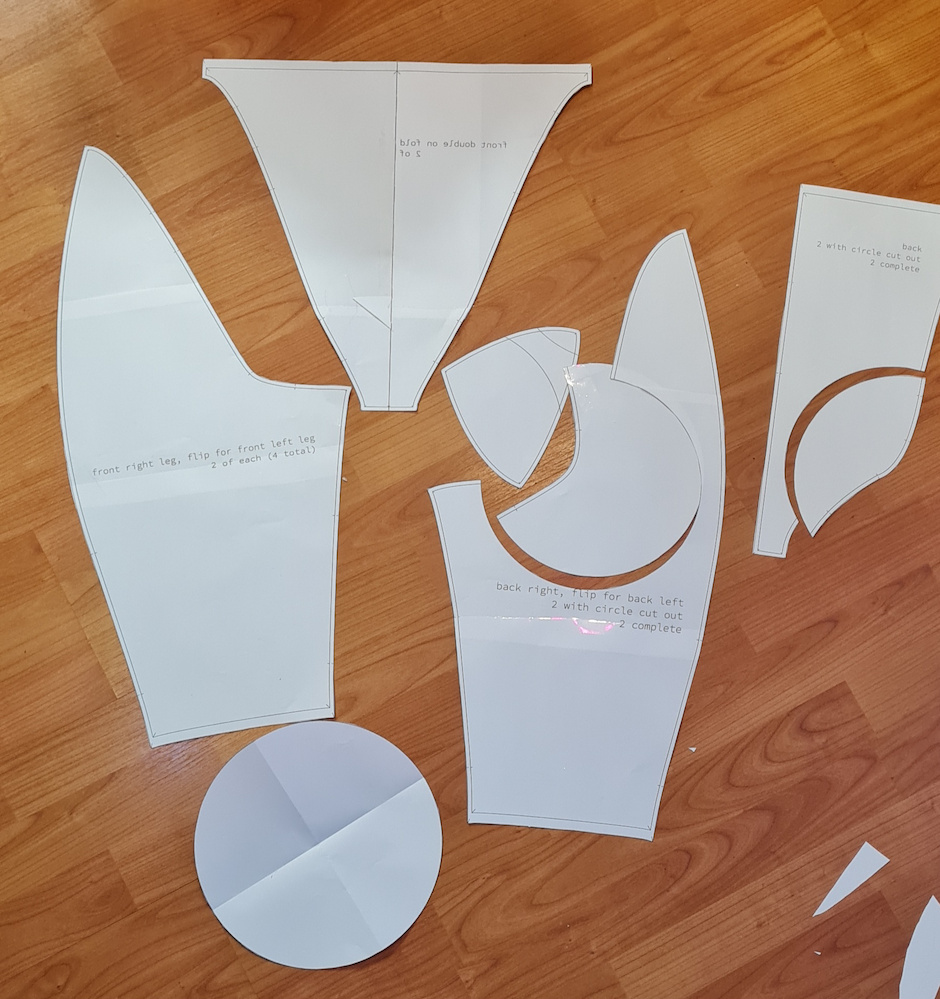
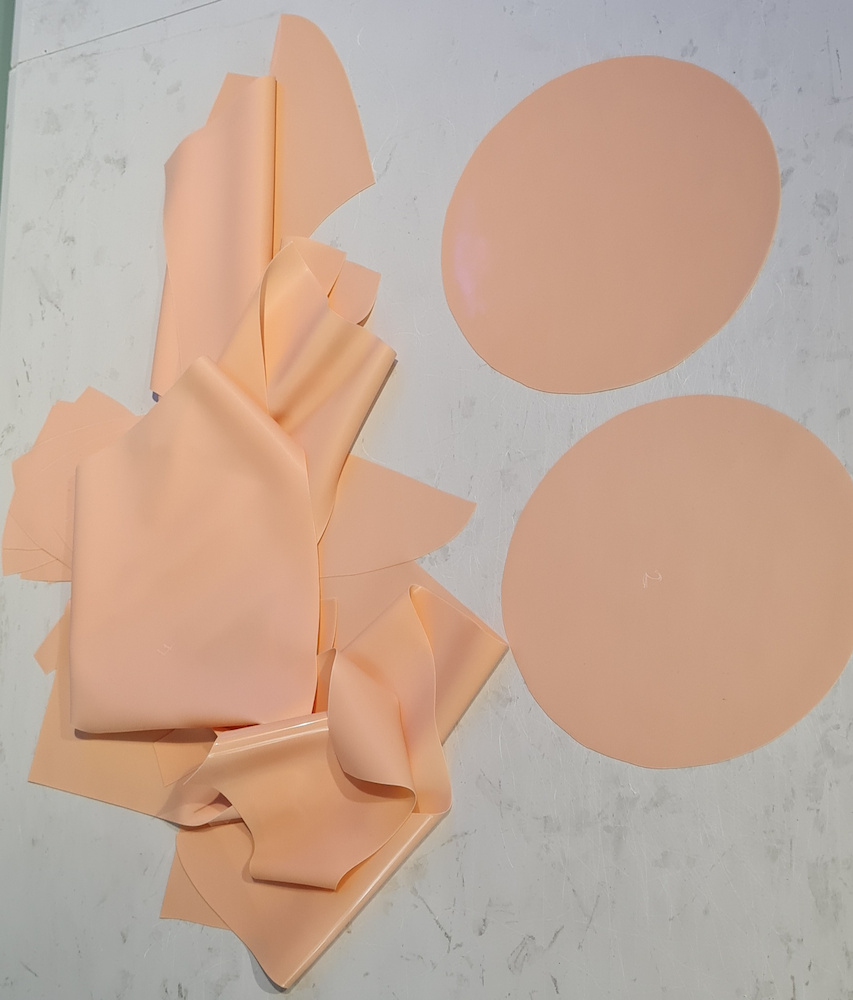

# Pattern transfer

So now you have a paper pattern cut out and ready to transfer to latex.

You now need to transfer that onto the latex sheet, being careful not
to stretch the sheet.  One piece of the pattern is actually folded on
the centre line, so when you transfer it to latex be sure to flip it
and not cut down that centre line. I did this in inkscape and printed it
with both sides so I didn't forget.

Some pieces you need to cut out twice because we have an inner and an outer
layer. So you should have:

outer layer:
* front right leg part, two of these, flip and do two more for front left leg
* back centre piece one of these normal, one fipped
* back leg piece one of these normal, one flipped
* waist band sections. I made four of these and laminated them so the band was a total of 1mm thick.

inner layer:
* eight segments of butt cups (4 per butt cup)
* a circle, we need two of these, for the back of the butt cups
* front piece that was flipped on the centre line, one of these
* back centre piece with the partial circle cut out, one of these normal, one flipped
* back leg piece with the partial circle cut out, one of these normal, one flipped

Do make sure that you label the pieces and transfer the registration
marks. Note the butt cups have one side different to the other two
(and that is the "bottom") so make sure to label that.

Now you have a pile of latex ready to assemble. Relax and have a nice
cup of tea. At this point I usually just end up putting it all in a
bag ready to assemble on another day as cutting the latex is time
consuming.

Now on to part 4: construction: https://github.com/kigyui/latexpatterns/blob/master/inflatablehips/04a-construction-inner.md
