# Construction (Inner)

I decided to have the shiny side of the latex of the outer layer facing outwards, and the matt side of the latex of the inner layer facing inwards, but
it's not visible so not really important. And I messed up and my front panel is actually reversed. That's fine no one will know.

The pattern is designed for 8mm seams for most places, but more when we come to attach the outer and inner layers.

So let's make the inner shorts. Start by assembling the inflatable butt cups by joining 4 of the petals.

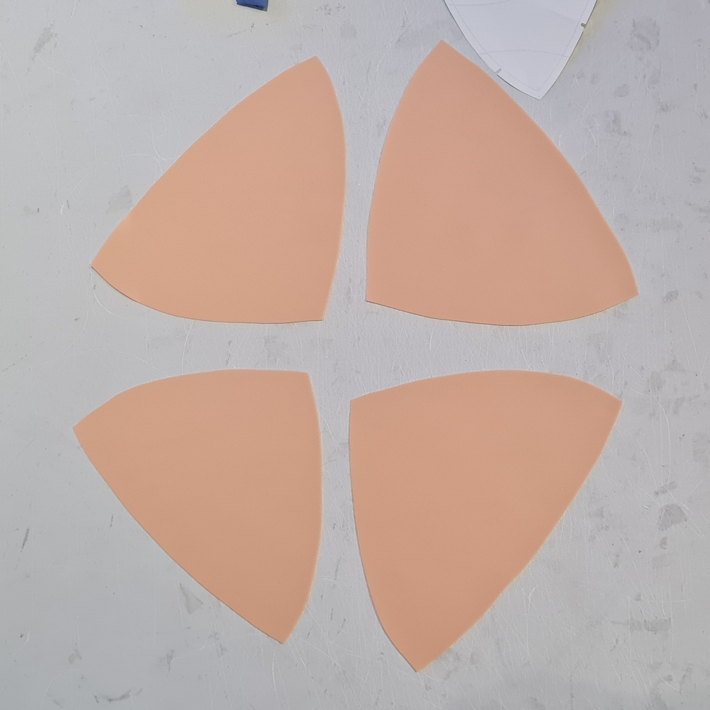

You'll end up with something that looks like this. Make two of them. Pay attention to the middle join where you have 4 overlapping pieces as this
is the place where you're most likely to have air leaks. I added extra glue here and really made sure it was rolled well. You can also add a small
circle of latex over the top (it's not visible in the final shorts) to help with this.

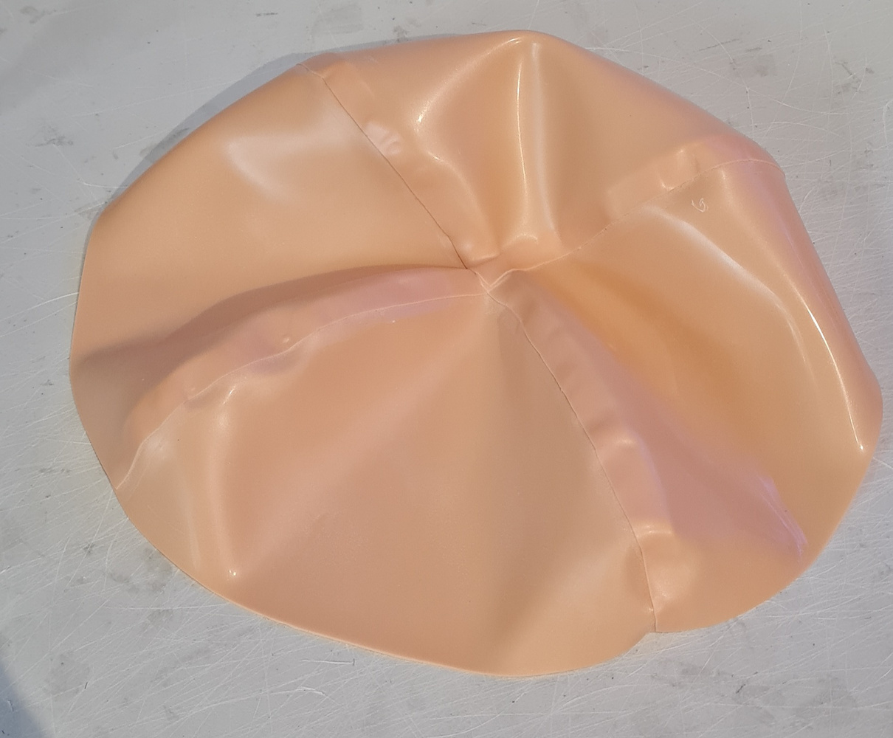

Next attach the two parts of rear panels that have the circle cut out, again make both the left and right

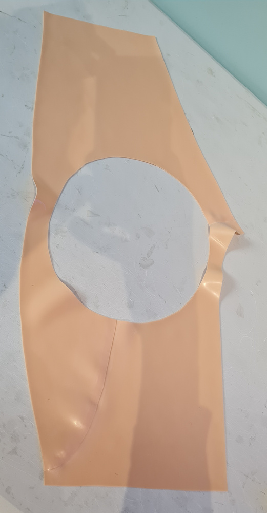

Now attach the butt panel into the rear panel. I glued the shiny side of the butt panel to the matt side of the hole, so it 'pokes through'. This becomes
important later when we put the back piece on.

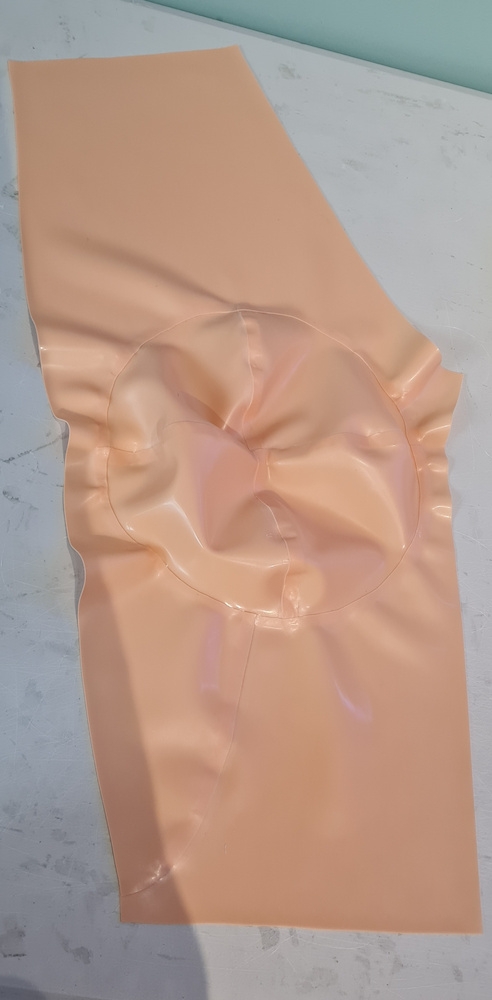

Next make some valves. This can be annoying. I had some spare latex medical grade tubing available which sticks with latex glue, so I made a small hole
in a piece of scrap latex, added glue, pulled the tubing through which created a moderately good seal. Then a small strip of 8mm latex with glue on both
sides was wrapped around it, making this:

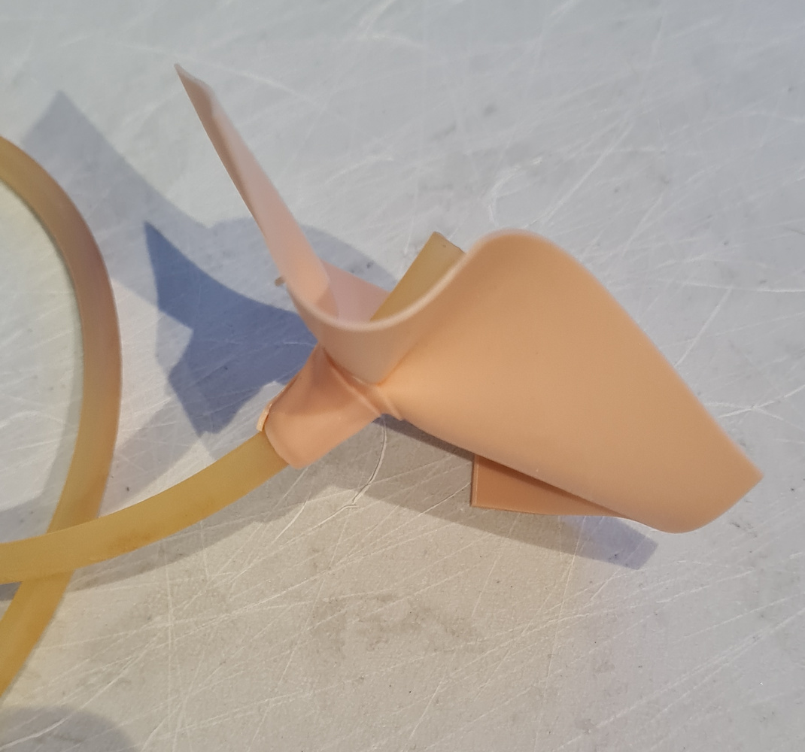

You'll eventually need four of them. I made another hole in the circle, glued the valve piece to that, and added another 8mm latex strip around the back
side of it.

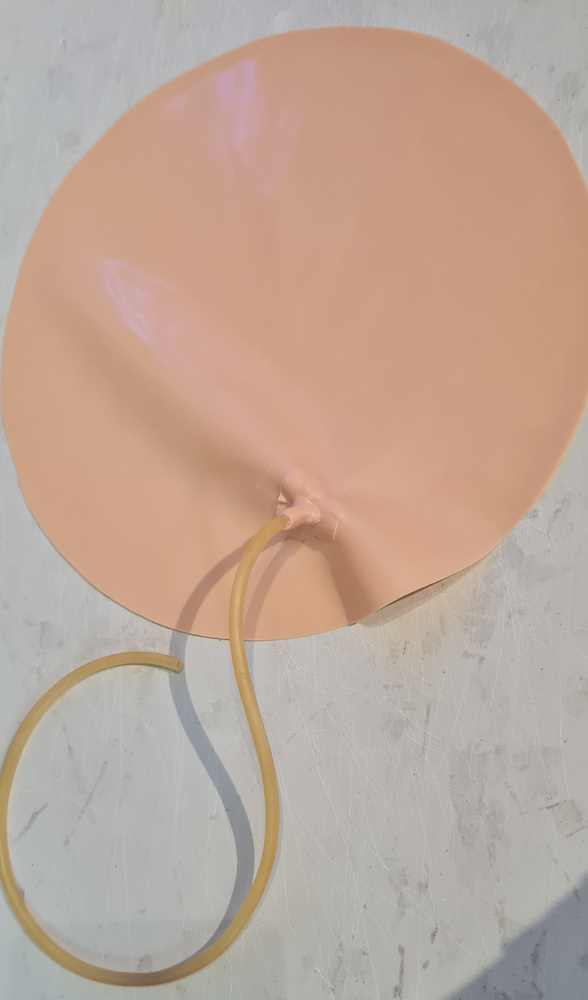

Next attach that circle over the top of the butt pad. Here it's on the matt side of the panel. So the circle completely covers the butt pad and has a nice
8mm overlap.

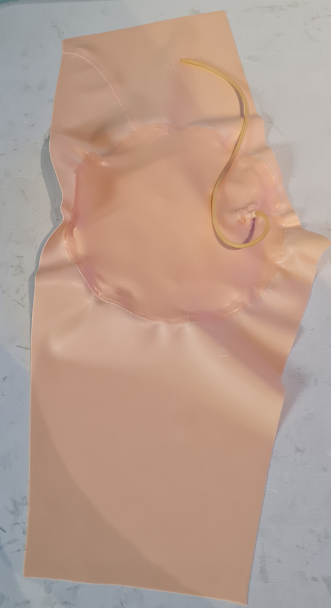

And this is what it looks like from the other side. This is a good time to test and add some air and make sure there are no leaks. You should have two
of these now.

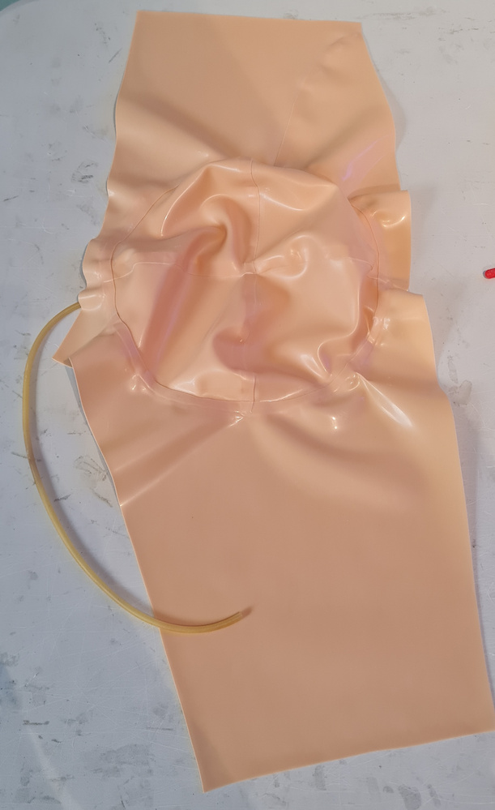

Next let's prepare the front panel.

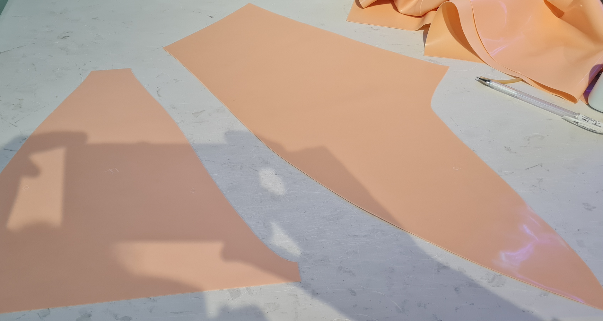

Attach the front sides to the front panel. I put my front panel matt side outwards by mistake here.

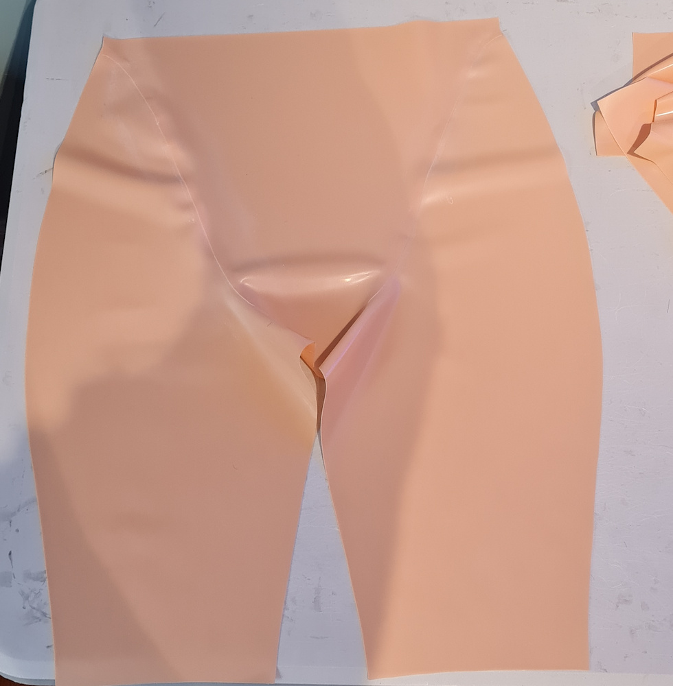

Let's join the back pieces together too

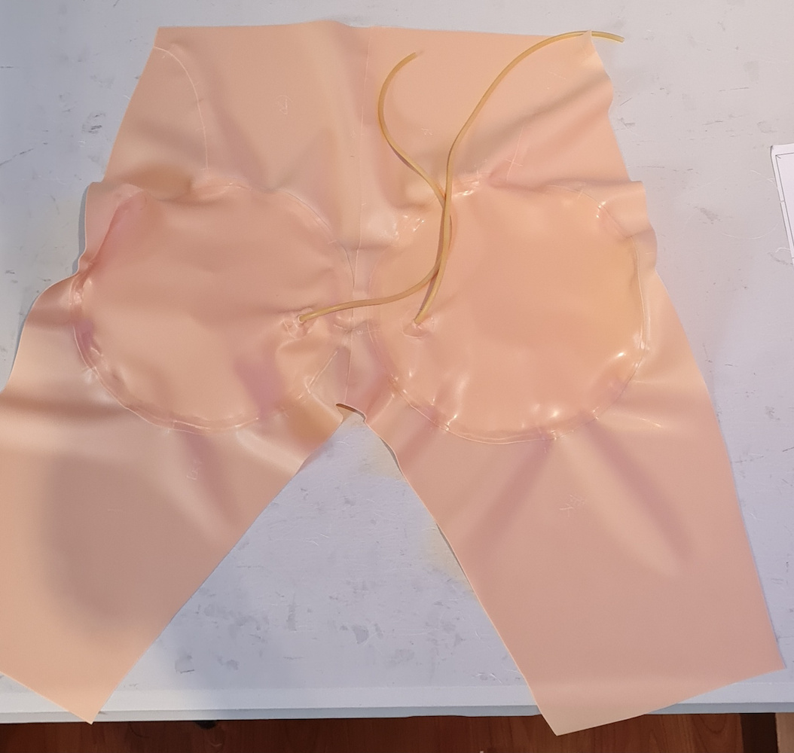

Next join the front and back pieces at the crotch and down the inside legs, so the sides are still open.

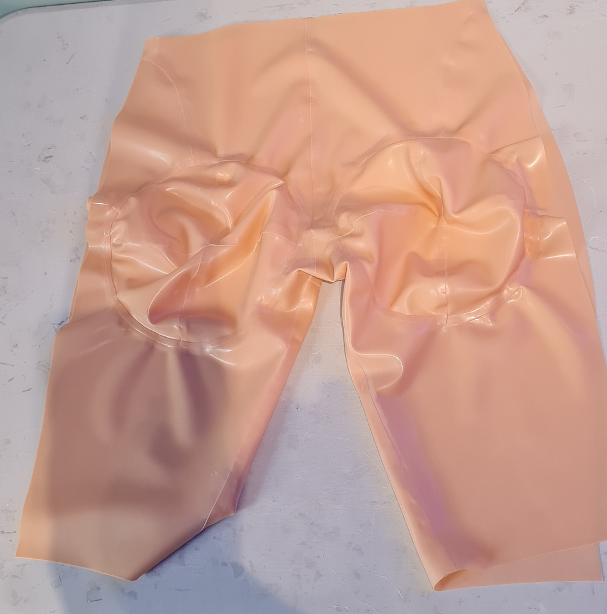

Then join the sides to each other

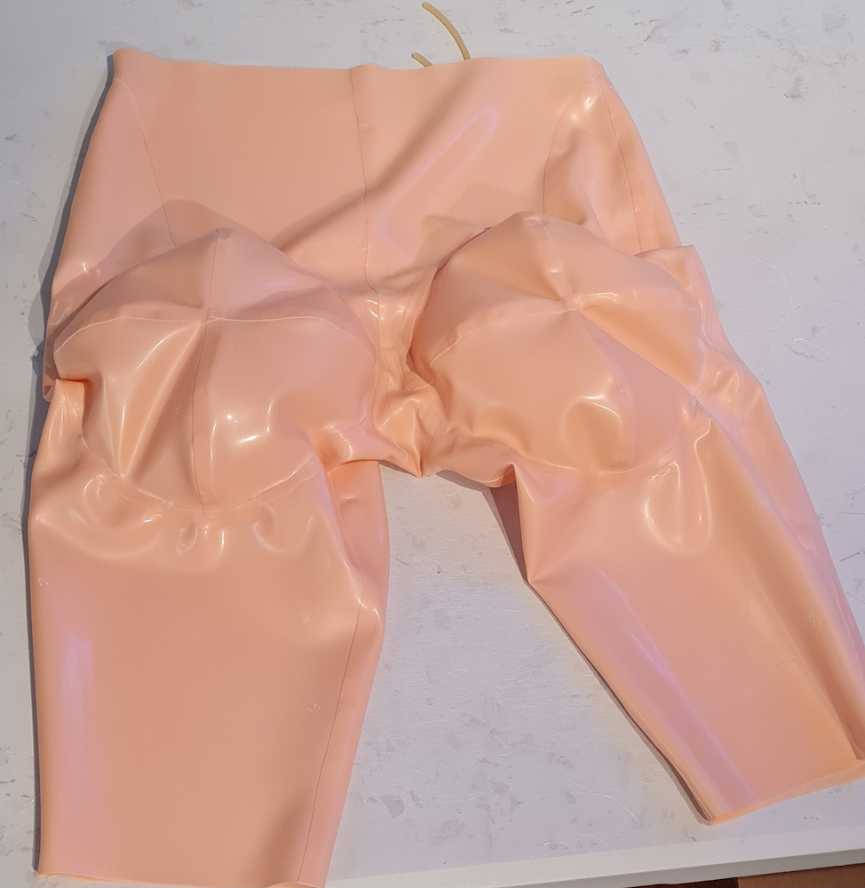

Add in the valves for the two hip sections. They don't do anything yet until we have the outer layer.

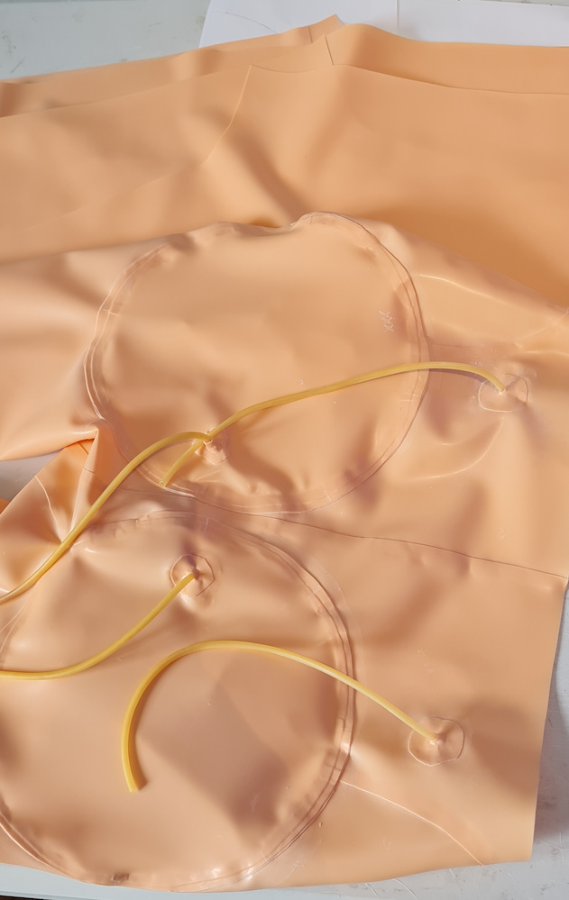

And now the inside shorts are complete.

Now on to part 4b: construction outer: https://github.com/kigyui/latexpatterns/blob/master/inflatablehips/04b-construction-outer.md
