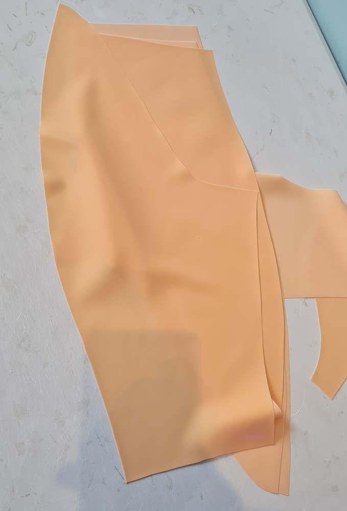
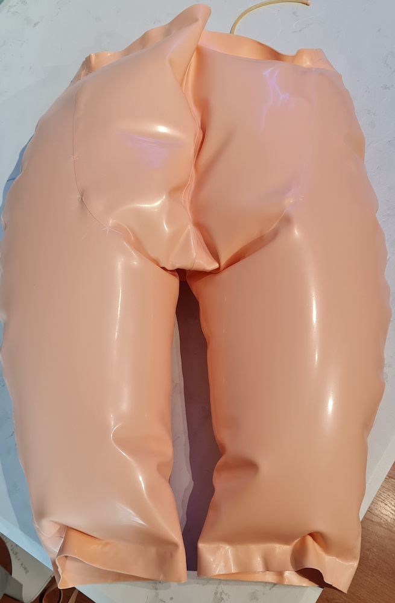
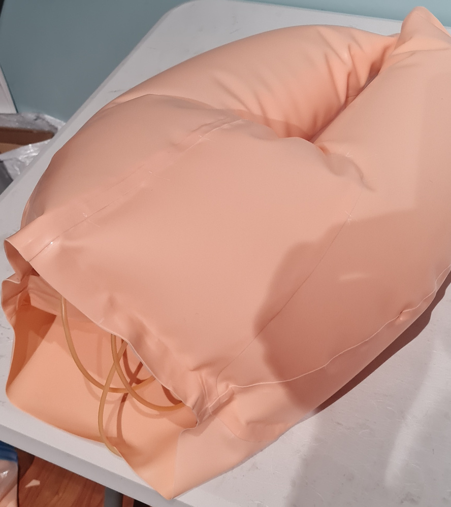

# Construction (Outer)

Let's not procastinate and get the outer layer done. It's cut out and prepared.

We join the two parts of one of the back panels. Then join the completed back panel to one of the front panels down the crotch and inside leg.

Now the complex bit where we attach this half over the inner shorts. You need to add glue seams to the inner shorts down the centre back seam,
across the crotch, up the front panel, and across the top band. Around the crotch and across the top I used a 20mm seam instead of 8mm. Then attach
the outside layer. Note that you're not attaching the outside hips of the inner or outer layer, and not attaching the inside legs of the inner and
outer layer together.

TBD This might need an annotated picture

Okay, so that's one hip complete. You could test this now and make sure it's air tight. Repeat for the other side. Here are some
pics after a test inflation.

Then add the waistband to the top. I don't have any pics of this step, it was just a straight 60mm wide laminated
strip (so 1mm thick) in two parts, one for the front and one for the back, added with a 8mm seam to the inside of the
shorts.

Now on to part 5: finished: https://github.com/kigyui/latexpatterns/blob/master/inflatablehips/05-finished.md
